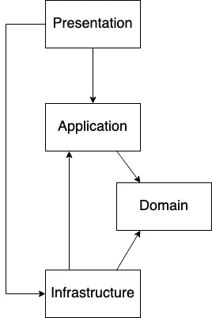

# Velox Architecture

## Domain Driven Design Layers

### Presentation Layer

The Presentation Layer is responsible for handling user interactions and presenting information to users. It is where the user interface resides and it interacts with the application layer to get and process the required data. The presentation layer should be designed in such a way that it is decoupled from the application layer to enable the application layer to evolve independently. It is important to design the presentation layer with a user-centric approach that focuses on the user's needs and requirements, rather than solely on technical implementation details. The presentation layer should be easy to maintain, extend and change, and it should follow the SOLID principles of software design.

### Application Layer

The Application Layer is responsible for coordinating business logic and translating high-level commands from the Presentation Layer into lower-level operations that can be performed by the Domain Layer. The Application Layer acts as a facade that hides the complexity of the Domain Layer from the Presentation Layer and other clients. It is responsible for transaction management, security, and validation. It should also enforce business rules and policies, and orchestrate the interactions between different parts of the system. The Application Layer should be designed in such a way that it is reusable, extensible, and testable. It should be loosely coupled to the other layers of the system, enabling each layer to evolve independently.

### Domain Layer

The Domain Layer represents the core of the business logic and knowledge of the system. It encapsulates the domain concepts, business rules, and behaviors of the system. The Domain Layer should be designed with a domain-centric approach that focuses on the understanding and modeling of the domain, rather than technical implementation details. It should be designed to be reusable and extendable, enabling the domain model to evolve as the business requirements change. The Domain Layer should also be decoupled from the infrastructure and application layers, allowing it to be tested independently and to support multiple user interfaces and data sources. The Domain Layer is critical to the success of a Domain Driven Design project as it is the source of competitive advantage and differentiation for the system.

### Infrastructure Layer

The Infrastructure Layer is responsible for providing support to the other layers by providing the necessary technical infrastructure such as databases, messaging systems, and external services. The Infrastructure Layer should be designed to be decoupled from the other layers to enable them to evolve independently. It should also provide abstractions and interfaces that shield the Domain Layer and Application Layer from the complexities of the underlying infrastructure. The Infrastructure Layer should be designed to be modular and replaceable, enabling the system to adapt to changing technical requirements and to support different deployment environments. The Infrastructure Layer is critical to the success of a Domain Driven Design project as it provides the foundation upon which the other layers can build.
