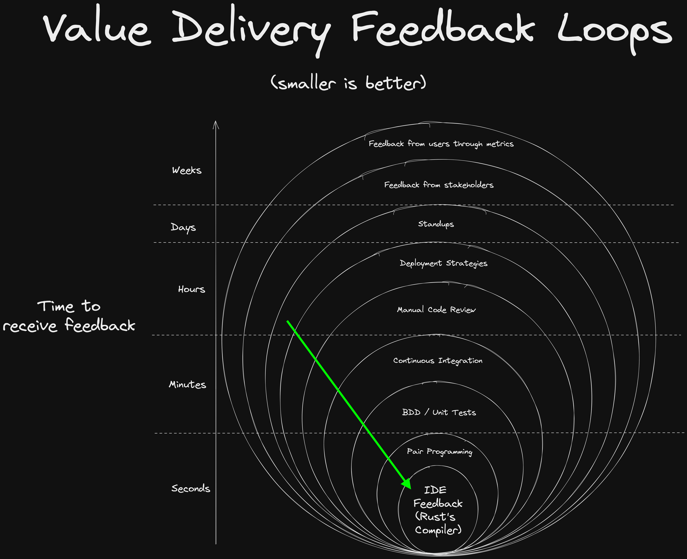

# Why Rust?

<!-- markdownlint-disable MD033 -->

## Speed of development

Rust's compiler shrinks the feedback loop between writing code and seeing the results. This makes it easy to iterate quickly and experiment with new ideas.



## Metaprogramming with Macros

[Macros](https://doc.rust-lang.org/book/ch19-06-macros.html) in Rust are a powerful tool that allows developers to write code that can generate other code at compile-time ([metaprogramming](https://en.wikipedia.org/wiki/Metaprogramming)), making it possible to automate repetitive tasks, reduce boilerplate code, and achieve greater code reuse. Rust's macro system is highly flexible and expressive, allowing developers to define complex transformations on the code, such as code generation, syntactic transformations, and type inference. This makes Rust macros an excellent choice for tasks such as domain-specific language implementation, serialization and deserialization, and code optimization, among others. Furthermore, Rust's macro system is designed to be safe and predictable, preventing accidental code execution or memory errors, and producing clear error messages when issues arise.

## Focus on the "Happy Flow"

Rust's `?` syntax, `Result` and `Option` types, lack of null/nil, and `match` keyword combine to make it easy to write code that focuses on the "happy flow" of the program. This makes it easy to write code that is easy to read, understand and maintain.

<details>
  <summary>Click to take a look at some Rust vs Go code comparisons</summary>

### Go

```go
func DoSomething() (*MyResultType, error) {
    result, err := SomeOperation()
    if err != nil {
        return nil, err
    }
    return result, nil
}
```

In this example, the function DoSomething calls SomeOperation and checks the error value. If an error occurs, it is returned, otherwise the function returns the result.

Now let's take a look at the equivalent Rust code:

### Rust

```rust
fn do_something() -> Result<MyResultType, Error> {
    let result = some_operation()?;
    Ok(result)
}
```

In Rust, the ? operator is used to propagate errors up the call stack. If an error occurs in some_operation, it is returned as a Result type, and the ? operator automatically returns the error from the some_operation function up the stack.

Here's how the outer function might look like in Go:

### Go (outer function)

```go
func doSomethingElse() (*MyResultType, error) {
    val, err := SomeOperation()
    if err != nil {
        if errors.Is(err, ErrorKindNotFound) {
            fmt.Println("Xyz resource was not found")
            return nil, ErrorKindNotFound
        }
        fmt.Println("A different error message")
        return nil, err
    }
    return val, nil
}
```

The indentation here for such a simple case makes the code increasingly difficult to read. The `if` statements are nested, and the `return` statements are scattered throughout the function. A reference to nil occurs 4(!) times, and all this combines to make it much harder follow the intended, "happy" flow of the code.

Here's how Rust's match statements can be used to handle different error conditions, reduce indentation, and keep the focus on the happy flow:

### Rust (outer function)

```rust
fn do_something_else() -> Result<MyResultType, Error> {
    let result = match some_other_operation() {
        Ok(val) => val,
        Err(ErrorKind::NotFound) => {
            println!("Xyz resource was not found")
            return err;
        },
        Err(err) => {
            println!("A different error message")
            return err;
        },
    };
    Ok(result)
}
```

In this example, the `match` statement is used to handle different error conditions. If the `some_other_operation` call returns an Ok value, the result is assigned to result. If the call returns a NotFound error, the function returns an error with the same type. If the call returns any other error, the function returns that error.

Rust's error handling, ? syntax, and match statements work together to keep the focus on the happy flow by providing concise and expressive ways to handle errors and propagate them up the call stack. This makes it easier for developers to write correct and maintainable code, and it makes it easier for other developers to read and understand the code. The value in this is hard to overstate.

</details>

## Memory Safety

Rust is designed to eliminate many common programming errors such as buffer overflows and null / nil pointer dereferences, which can lead to bugs and security vulnerabilities. This makes Rust best in class for developing secure and reliable software.

## Community support

Rust has a growing and active community of developers who contribute to its ecosystem of libraries and tools. There is often a "best-in-class" crate for any given problem at hand, meaning you learn one API and you needn't learn another. Rust libaries have a tendency to end up "[finished](https://www.youtube.com/watch?v=Q3AhzHq8ogs)", often requiriing little to no maintenance. This means that you can focus on your application's domain logic, rather than the plumbing.

## Performance

When evaluating the performance of programming languages, individual benchmarks may be vulnerable to manipulation and difficult to interpret. To mitigate this issue, the [Benchmarks Game](https://benchmarksgame-team.pages.debian.net/benchmarksgame/fastest/rust-go.html) has assessed multiple algorithms for each language, comparing various stats from their performance to provide a more comprehensive evaluation of language tradeoffs.

[Test link](https://github.com/liamwh/Veloxide/blob/main/docs/Why-Rust.md#performance)

In the Benchmarks Game's evaluation of various algorithms, Rust demonstrated superior optimization compared to Go. The most optimized Rust code outperformed the most optimized Go code by at least 30% across all tested algorithms, with some benchmarks showing even greater differences. For instance, in the binary-trees benchmark, Rust's most optimized code was 12 times faster than Go's. Additionally, in many cases, even the least optimized Rust code was faster than the most optimized Go code.


## Conclusion

Overall, Rust provides a better developer experience by providing a shorter feedback loop and more legible code, Rust code is considered more secure than any other language out there, it's more performant than just about all languages except C, and it has a vibrant community of developers who contribute to its ecosystem of libraries and tools. These factors make Rust an outstanding choice for developing secure, reliable, and performant software of any kind.

Why **_wouldn't_** you choose rust for your next project?

## Additional Resources

- [Considering Rust](https://www.youtube.com/watch?v=DnT-LUQgc7s)
